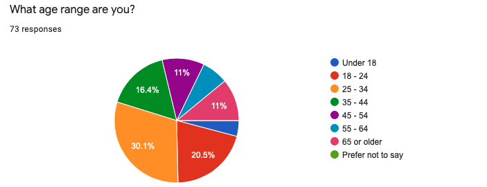
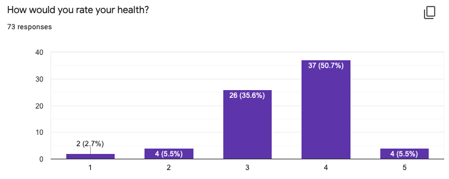
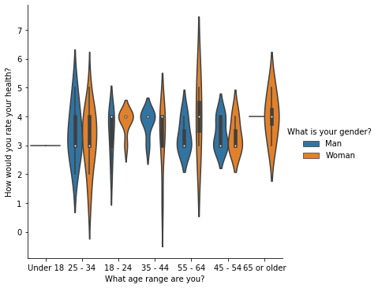
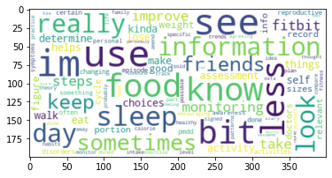
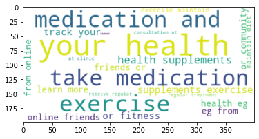
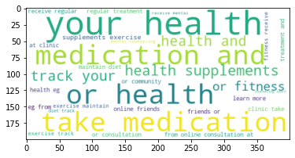

<body style="font-family:Arial; font-size: 12pt">

### Table of Contents

1. [What is Google Cloud API?](#link1)
2. [Survey Data in User Research](#link2)
3. [Natural Language API Features](#link3)<br>
    3.1 [Entity Analysis](#link3.1)<br>
    3.2 [Sentiment Analysis](#link3.2)<br>
    3.3 [Entity Sentiment Analysis](#link3.3)<br>
4. [Loading in data using Google Sheets API](#link4)
5. [Dataset](#link5)
6. [Data Analysis](#link6)
7. [Research Question](#link7)<br>
    7.1 [A. Health Rating by Gender](#link7.1)<br>
    7.2 [B. Health Rating by Age Group](#link7.2)<br>
    7.3 [C. T-test for Statistical Signifcance](#link7.3)<br>
    7.4 [D. Health Rating by Age & Gender Group](#link7.4)<br>
    7.5 [E. Iteratively Running t-test Within Each Age Group](#link7.5)<br>
8. [Data Visualization](#link8)<br>
    8.1 [Characterizing Textual Data Through Wordcloud](#link8.1)<br>
9. [Conclusion](#link9)<br>

<br>

### <a name="link1"> What is Google Cloud API? </a>

**Google Cloud Platform** is a suite of cloud computing services that lets developers interact with APIs that involve data storage, data analytics, and machine learning. In this notebook, I build on to the previous notebook to call in the spreadsheets from Google Drive, and run textual data analysis using the Cloud Natural Language API and vector space models.

**[Natural Language AI](https://cloud.google.com/natural-language)** is an API available in Google Cloud. It uses machine learning to analyze texts through sentiment analysis and extract information about the text itself. It offers three types of models:

1. **Auto ML**: that allows you to train your own model
2. **<mark>Natural Language API</mark>**: that offers pre-trained models to quickly boot up NLP.
3. **Healthcare Natural Language AI**: that is specific for medical texts.

For the sake of time scope and complexity of the project, let's use the Natural Language API to call in a pre-trained model to analyze textual data. The demo of the model can be found online here: https://cloud.google.com/natural-language.


### <a name="link2"> Survey Data in User Research </a>

As a UX researcher, survey studies are essential for understanding the users because they can be quickly developed and sent out to receive a good amount of sample in a short period of time. **Surveys are powerful tools to be utilized for conducting preliminary research at the discovery stage to explore the general problem space and user behaviors.**

One of the free and efficient tools is the Google Forms. While it can automatically generate pie graphs and bar graphs to summarize the survey results, the results are often too limited. **As researchers, we might be interested in learning more in depth about the data. After all, it is researchers' role to develop a keen sense to analyze the data and drive insights.**

For instance, the screenshots below show sample summaries of what Google Form summary is capable of doing.

#### Breakdown of participants' age range


#### Participants' self perception of their health wellness


**The graphs above do not show any relationship between the data.** To drive more meaningful insights, we would want to explore if there are any relationships between the data. For example, we would want to know how self perception of health wellness varies by different age groups. Do older people perceive themselves to be less healthy than young people do? While the ratings are subjective, the analysis itself can hint towards meaningful insights.

#### Objectives
**I use GoogleSheets API to call in the data and analyze the survey results to visualize the relationship between data and test statistical significance. I also incorporate Natural Language API to analyze textual data collected from the survey, and visualize them through violin graphs and word cloud.**

<br>
---

## <a name="link3"> Natural Language API Features </a>

**Before diving straight to working with data, let's take a look at some of the features of NL API.**


### Setup


```python
# Imports the Google Cloud client library
import os
from google.cloud import language_v1

# set environment for credentials (need to be called with every start of instance)
# refer the reference tab for setting credentials
os.environ["GOOGLE_APPLICATION_CREDENTIALS"] = "/Users/Jin/google-cloud-sdk/natural-language-api.json"

# Instantiates a client
client = language_v1.LanguageServiceClient()

# Available types: PLAIN_TEXT, HTML
type_ = language_v1.Document.Type.PLAIN_TEXT

encoding_type = language_v1.EncodingType.UTF8
```

For the scope of this project, let's look at some specific methods that NL API offers.

**1. Entity analysis**<br>
**2. Sentiment analysis**<br>
**3. Entity Sentiment analysis**

### <a name="link3.1"> 1. Entity analysis </a>
`analyze_entities`: inspects the given text for known entities (proper nouns such as public figures, landmarks, etc.), and returns information about those entities.


```python
# grab a random text from wikipedia
text = u"The University of Washington is a public research university in Seattle, Washington.\
        Ana Mari Cauce is the president."

document = {"content": text, "type_": type_}

response = client.analyze_entities(request = {'document': document, 'encoding_type': encoding_type})

# Loop through entitites returned from the API
for entity in response.entities:
    print(u"Entity name: {}".format(entity.name))

    # Get entity type, e.g. PERSON, LOCATION, ADDRESS, NUMBER, et al
    print(u"Entity type: {}".format(language_v1.Entity.Type(entity.type_).name))

    # Get the salience score associated with the entity in the [0, 1.0] range
    print(u"Salience score: {}".format(entity.salience) + '\n')
```

    Entity name: University of Washington
    Entity type: ORGANIZATION
    Salience score: 0.7374827265739441

    Entity name: Ana Mari Cauce
    Entity type: PERSON
    Salience score: 0.11040862649679184

    Entity name: Washington
    Entity type: LOCATION
    Salience score: 0.07763731479644775

    Entity name: Seattle
    Entity type: LOCATION
    Salience score: 0.07447130978107452


### <a name="link3.2"> 2. Sentiment analysis </a>
`analyze_sentiment`: inspects the given text and identifies the prevailing emotional opinion within the text, especially to determine a writer's attitude as positive, negative, or neutral.


```python
def analyze_sentiment(text):
    """
    a simple function created to run sentiment analysis for a given text.

    Parameters
    ----------
    text : str
        string of text to be analyzed

    Returns
    -------
    sentiment.score: float
        sentiment score between -1.0 (negative sentiment) and 1.0 (positive sentiment).

    sentiment.magnitude: float
        a non-negative number in the [0, +inf) range, which represents the absolute \
        magnitude of sentiment regardless of score (positive or negative).
    """
    document = language_v1.Document(content=text, type_=language_v1.Document.Type.PLAIN_TEXT)

    # Detects the sentiment of the text
    sentiment = client.analyze_sentiment(request={'document': document}).document_sentiment

    print("Text: {}".format(text))
    print("Sentiment: {}, {}".format(sentiment.score, sentiment.magnitude))

    return sentiment.score, sentiment.magnitude
```

Let's try feeding in some random sentences and see how sentiments come out.


```python
# The text to analyze
text = u"The dish was delightfully surprising."
text2 = u"The overall experience was terrible."

analyze_sentiment(text)
print('\n')
_, _ = analyze_sentiment(text2)
```

    Text: The dish was delightfully surprising.
    Sentiment: 0.8999999761581421, 0.8999999761581421


    Text: The overall experience was terrible.
    Sentiment: -0.800000011920929, 0.800000011920929


### <a name="link3.3"> 3. Entity sentiment analysis </a>
`analyze_entity_sentiment`: combines both entity analysis and sentiment analysis and attempts to determine the sentiment (positive or negative) expressed about entities within the text.


```python
def analyze_entity_sentiment(text):
    """
    a simple function to run entity sentiment analysis for a given text.

    Parameters
    ----------
    text : str
        string of text to be analyzed

    Returns
    -------
    entity.name: str
        name of the entity identified

    entity.type.name: str
        type of the entity identified

    sentiment.score: float
        sentiment score between -1.0 (negative sentiment) and 1.0 (positive sentiment).

    sentiment.magnitude: float
        a non-negative number in the [0, +inf) range, which represents the absolute \
        magnitude of sentiment regardless of score (positive or negative).
    """
    document = {"content": text, "type_": type_}

    encoding_type = language_v1.EncodingType.UTF8

    response = client.analyze_entity_sentiment(request = {'document': document, 'encoding_type': encoding_type})
    # Loop through entitites returned from the API
    for entity in response.entities:
        print(u"Entity name: {}".format(entity.name))

        # Get entity type, e.g. PERSON, LOCATION, ADDRESS, NUMBER, et al
        print(u"Entity type: {}".format(language_v1.Entity.Type(entity.type_).name))

        # Get the salience score associated with the entity in the [0, 1.0] range
        print(u"Salience score: {}".format(entity.salience))

        # Get the aggregate sentiment expressed for this entity in the provided document.
        sentiment = entity.sentiment
        print(u"Entity sentiment score: {}".format(sentiment.score))
        print(u"Entity sentiment magnitude: {}".format(sentiment.magnitude))
        print('\n')

    return entity.name, language_v1.Entity.Type(entity.type_).name, sentiment.score, sentiment.magnitude
```

Let's try feeding in one neutral sentence, and a positive sentence.


```python
text = u"The University of Washington is a public research university in Seattle, Washington.\
        The HCDE Department offers amazing opportunities to study UX and HCI."

_, _, _, _ = analyze_entity_sentiment(text)
```

    Entity name: University of Washington
    Entity type: ORGANIZATION
    Salience score: 0.7403186559677124
    Entity sentiment score: 0.0
    Entity sentiment magnitude: 0.0


    Entity name: Washington
    Entity type: LOCATION
    Salience score: 0.07140954583883286
    Entity sentiment score: 0.0
    Entity sentiment magnitude: 0.0


    Entity name: Seattle
    Entity type: LOCATION
    Salience score: 0.06301160156726837
    Entity sentiment score: 0.0
    Entity sentiment magnitude: 0.0


    Entity name: HCDE Department
    Entity type: ORGANIZATION
    Salience score: 0.04862694814801216
    Entity sentiment score: 0.8999999761581421
    Entity sentiment magnitude: 0.8999999761581421


    Entity name: UX
    Entity type: OTHER
    Salience score: 0.03587672486901283
    Entity sentiment score: 0.699999988079071
    Entity sentiment magnitude: 0.699999988079071


    Entity name: HCI
    Entity type: OTHER
    Salience score: 0.025248046964406967
    Entity sentiment score: 0.800000011920929
    Entity sentiment magnitude: 0.800000011920929


    Entity name: opportunities
    Entity type: OTHER
    Salience score: 0.015508485026657581
    Entity sentiment score: 0.8999999761581421
    Entity sentiment magnitude: 0.8999999761581421


From the result above, we can see that the first sentiment of the entities identified in the first sentence, such as 'University of Washington' or 'Seattle' has a sentiment score of 0.0 which means neutral. This makes sense because the sentence was directly pulled from Wikipedia. On the other hand, the second sentence I wrote highlights 'HCDE Department' as an entity with positive sentiment score of 0.8999.

#### So what's next?
We can interchangeably use the two functions defined `analyze_sentiment` and `analyze_entity_sentiment` to identify the overall sentiment of a given text or entity if specified in the data analysis process.

---
<br>

## <a name="link4"> Loading in data using Google Sheets API </a>

The following code will only run if you have your Google `credential.json` and `token.json` within the working directory.


```python
from __future__ import print_function
import os.path
from googleapiclient.discovery import build
from google_auth_oauthlib.flow import InstalledAppFlow
from google.auth.transport.requests import Request
from google.oauth2.credentials import Credentials

SCOPES = ['https://www.googleapis.com/auth/spreadsheets.readonly']
SPREADSHEET_ID = '11Den6g5nuR4B2CCUML1KrA0bEZXRpPZ7t83Ieyi7NJ4'

# Specify which sheet or row/column of data to call in
# refer to https://developers.google.com/sheets/api/guides/concepts#a1_notation for detail
RANGE_NAME = 'health_data'

creds = Credentials.from_authorized_user_file('token.json', SCOPES)
service = build('sheets', 'v4', credentials=creds)

# Call the Sheets API to read in the data
sheet = service.spreadsheets()
result = sheet.values().get(spreadsheetId = SPREADSHEET_ID,
                            range = RANGE_NAME).execute()
values = result.get('values', [])

# convert the sheet to pandas dataframe so we can easily manipulate the data
import pandas as pd

data = pd.DataFrame(values[1:], columns=values[0])

# let's confirm
print(type(data))

data.shape
```

    <class 'pandas.core.frame.DataFrame'>

    (71, 27)

<br>

---
<br>

## <a name="link5"> Dataset </a>
From the code above, we translated the data into pandas dataframe. Using `data.shape`, we know that there are total 27 questions collected from 71 participants. For simplicity, I remove any data that does not prefer to disclose gender. This brings the data size to 68. Due to the extensive length and branching logic within the survey, the data becomes more textual and qualitative for questions or columns in the back. I will primarily use selected columns that are of interest.

Let's have a quick glance at the dataset.


```python
# for simplicity, let's constrain the gender option to only two
gender_options = ['Man', 'Woman']
data = data[data['What is your gender?'].isin(gender_options)]

print('There are total ' + str(len(data)) + ' participants.')
print('The survey consists of ' + str(data.shape[1]) + ' questions (columns in the dataframe).')

# convert the column string values to integers
data['How would you rate your health?'] = data['How would you rate your health?'].astype(int)

data.head(3)
```

    There are total 69 participants.
    The survey consists of 27 questions (columns in the dataframe).


<div>
<style scoped>
    .dataframe tbody tr th:only-of-type {
        vertical-align: middle;
    }

    .dataframe tbody tr th {
        vertical-align: top;
    }

    .dataframe thead th {
        text-align: right;
    }
</style>
<table border="1" class="dataframe">
  <thead>
    <tr style="text-align: right;">
      <th></th>
      <th>Timestamp</th>
      <th>What age range are you?</th>
      <th>What is your gender?</th>
      <th>What actions do you take regarding your health?</th>
      <th>How would you rate your health?</th>
      <th>Have you ever tracked your health and/or fitness?</th>
      <th>Why do you not track your health and/or fitness?</th>
      <th>How do you generally like to keep track of activities?</th>
      <th>Which of the following did you keep track of? (Select all that apply.)</th>
      <th>What did you use to record your health and/or fitness? (Select all that apply.)</th>
      <th>...</th>
      <th>Which of the following do you keep track of? (Select all that apply.)</th>
      <th>What do you use to record your health and/or fitness? (Select all that apply.)</th>
      <th>If you use any app or device, could you tell us which one(s)?</th>
      <th>Why do you track your health and/or fitness?</th>
      <th>Is there anything you like about your current health and/or fitness tracking method?</th>
      <th>In the last 30 days, how often have you tracked your health and/or fitness?</th>
      <th>Who views your health and/or fitness information?</th>
      <th>How is your health and/or fitness information being used?</th>
      <th>What, if anything, has been helpful about the information you tracked?</th>
      <th>Is there anything that could be better about your current health and/or fitness tracking method?</th>
    </tr>
  </thead>
  <tbody>
    <tr>
      <th>0</th>
      <td>2020/07/18 9:59:33 AM EST</td>
      <td>Under 18</td>
      <td>Man</td>
      <td>Exercise;Learn more about your health (e.g. fr...</td>
      <td>3</td>
      <td>Yes and I am currently still tracking</td>
      <td></td>
      <td></td>
      <td></td>
      <td></td>
      <td>...</td>
      <td>Exercise (e.g. Steps taken, Distance, Calories...</td>
      <td>Mobile App</td>
      <td>Google fit and Pixels</td>
      <td>It's interesting to look back at the data I ha...</td>
      <td>My mood tracking method is very useful for dis...</td>
      <td>Everyday</td>
      <td>Myself</td>
      <td>It's only used by me. It simply interests me.</td>
      <td>I have concluded that I am prone to mood swing...</td>
      <td>It could be more extensive.</td>
    </tr>
    <tr>
      <th>1</th>
      <td>2020/07/18 10:15:07 AM EST</td>
      <td>25 - 34</td>
      <td>Man</td>
      <td>Exercise</td>
      <td>4</td>
      <td>Yes, I have tracked before but not in the last...</td>
      <td></td>
      <td></td>
      <td>Cardiovascular (e.g. Heart rate, Blood pressur...</td>
      <td>Wearable;Mobile App</td>
      <td>...</td>
      <td>None</td>
      <td>None</td>
      <td>None</td>
      <td>None</td>
      <td>None</td>
      <td>None</td>
      <td>None</td>
      <td>None</td>
      <td>None</td>
      <td>None</td>
    </tr>
    <tr>
      <th>2</th>
      <td>2020/07/18 10:32:24 AM EST</td>
      <td>18 - 24</td>
      <td>Man</td>
      <td>None of the above</td>
      <td>2</td>
      <td>No</td>
      <td>I eat very little junk food, and am very thin....</td>
      <td>To do lists and notes</td>
      <td>None</td>
      <td>None</td>
      <td>...</td>
      <td>None</td>
      <td>None</td>
      <td>None</td>
      <td>None</td>
      <td>None</td>
      <td>None</td>
      <td>None</td>
      <td>None</td>
      <td>None</td>
      <td>None</td>
    </tr>
  </tbody>
</table>
<p>3 rows × 27 columns</p>
</div>


---
<br>

## <a name="link6"> Data Analysis </a>
Now that we have seen the general dataframe structure, let's explore probing the data for analysis.


```python
import os
import pandas as pd
from collections import Counter
import re
import numpy as np
import matplotlib.pyplot as plt
import seaborn as sns
from nltk.corpus import stopwords
import warnings
from wordcloud import WordCloud, STOPWORDS, ImageColorGenerator
import scipy
from tabulate import tabulate

warnings.simplefilter(action='ignore', category=FutureWarning)  # suppress any warning
sns.set_color_codes('pastel')  # set color
```

### Querying data
Before we play around with data, let's query out the data that are of interest. This way we can manipulate the data more effectively without having to call on the entire dataset `data` everytime.

There are total 7 different age groups.


```python
# let's divde the data by gender first
females = data.loc[data['What is your gender?'] == 'Woman']
males = data.loc[data['What is your gender?'] == 'Man']

# let's also create dataset divided by age group
age_under18 = data.loc[data['What age range are you?'] == 'Under 18']
age_18to24 = data.loc[data['What age range are you?'] == '18 - 24']
age_25to34 = data.loc[data['What age range are you?'] == '25 - 34']
age_35to44 = data.loc[data['What age range are you?'] == '35 - 44']
age_45to54 = data.loc[data['What age range are you?'] == '45 - 54']
age_55to64 = data.loc[data['What age range are you?'] == '55 - 64']
age_over65 = data.loc[data['What age range are you?'] == '65 or older']
```


```python
print(len(males))
print(len(females))
```

    31
    38


---
<br>

## <a name="link7"> Research Question </a>

> <mark>_How does self-perception of health rating differ by gender and age?_</mark>

Participants were asked, How would you rate your health? (5 being healthy, 1 being not healthy).

<br>

### <a name="link7.1"> A. Health rating by gender </a>
Let's breakdown the data to see how self-perception of health wellness varies by gender and different age groups. In the code below, I first quary females and males from the data.


```python
# columns[4] is the column for health rating
mean_males = np.mean(males[males.columns[4]])
mean_females = np.mean(females[females.columns[4]])

print("Mean of males' self-health wellness: " + str(mean_males))
print("Mean of females' self-health wellness: " + str(mean_females))
```

    Mean of males' self-health wellness: 3.5161290322580645
    Mean of females' self-health wellness: 3.4473684210526314

<br>

### <a name="link7.2"> B. Health rating by age group </a>

Now let's breakdown the data to see how self-perception of health wellness varies by different age groups.


```python
age = data.groupby('What age range are you?')['How would you rate your health?'].mean()
age
```


    What age range are you?
    18 - 24        3.615385
    25 - 34        3.285714
    35 - 44        3.500000
    45 - 54        3.375000
    55 - 64        3.600000
    65 or older    4.000000
    Under 18       3.000000
    Name: How would you rate your health?, dtype: float64


**Conversely, the age group 65 or older actually has the highest self-perception of wellness.** The youngest group (age under 18) rated the lowest.

<br>

### <a name="link7.3"> C. T-test for statistical signifcance </a>
With small samples of the two demographic groups `65 or older` and `Under 18`, we are not sure if the difference we see here is significant. **Let's run a quick t-test to see if the difference we are seeing is statistically significant.**


```python
t, p = scipy.stats.ttest_ind(age_over65['How would you rate your health?'], age_under18['How would you rate your health?'])

print('t: ' + str(t.round(4)))  
print('p: ' + str(p.round(4)))  # the p-val should be less than 0.05 in general to assume the difference we observe is signifcant
```

    t: 2.8983
    p: 0.0199


We see the p-value is 0.01 which is signifcant, which is one interesting find! So we can say that within this dataset, the people age over 65 perceive themselves to be more healthy than teenagers would do.

<br>

### <a name="link7.4"> D. Health rating by age & gender group </a>

Now let's breakdown by both gender and different age groups to look at how the self perception of health wellness change.


```python
age_gender = data.groupby(['What age range are you?', 'What is your gender?'])['How would you rate your health?'].mean().round(2)

age_gender
```


    What age range are you?  What is your gender?
    18 - 24                  Man                     3.43
                             Woman                   3.83
    25 - 34                  Man                     3.43
                             Woman                   3.21
    35 - 44                  Man                     3.80
                             Woman                   3.29
    45 - 54                  Man                     3.40
                             Woman                   3.33
    55 - 64                  Man                     3.33
                             Woman                   4.00
    65 or older              Man                     4.00
                             Woman                   4.00
    Under 18                 Man                     3.00
                             Woman                   3.00
    Name: How would you rate your health?, dtype: float64

<br>

### <a name="link7.5"> E. Iteratively running t-test within each age group </a>
We have several different age groups with each male and female gender group. Within each age group, let's run a t-test to see if there are any significant observed differences.


```python
gender_options = ['Man', 'Woman']
age_groups = ['age_under18', 'age_18to24', 'age_25to34', 'age_35to44', 'age_45to54', 'age_55to64', 'age_over65']

table = []
table.append(['age group', 't value', 'p value'])

# iteratively run for t-tests within each age group defined in the list variable 'age_groups'
for i in range(0, len(age_groups)):
    data_string = "['How would you rate your health?']"
    eval_string1 = age_groups[i] + '.loc[' + age_groups[i] + "['What is your gender?'] == 'Man']"
    a = eval(eval_string1 + data_string)
    eval_string2 = age_groups[i] + '.loc[' + age_groups[i] + "['What is your gender?'] == 'Woman']"
    b = eval(eval_string2 + data_string)
#     strings_combined = 'scipy.stats.ttest_ind(a, b)'

    t, p = eval('scipy.stats.ttest_ind(a, b)')

    # we use a package called tabulate to print out a formatted table
    table.append([age_groups[i], t.round(4) ,p.round(4)])

print(tabulate(table, headers='firstrow'))
```

    age group      t value    p value
    -----------  ---------  ---------
    age_under18   nan        nan
    age_18to24     -1.1315     0.2819
    age_25to34      0.4504     0.6575
    age_35to44      0.9682     0.3558
    age_45to54      0.1637     0.8754
    age_55to64     -0.7746     0.495
    age_over65      0          1


**We see that the p-values are all above 0.05 which means that there are no observed significant differences in gender within each age group.**

---
<br>

## <a name="link8"> Data Visualization </a>

Let's first try plotting a simple visual violin plot.


```python
age_plot = sns.catplot(x='What age range are you?', y='How would you rate your health?', \
                       hue='What is your gender?', kind="violin", data=data);
```





## <a name="link8.1"> Characterizing textual data through wordcloud </a>
Let's change focus and try analyzing textual inputs from the participants. We will analyze the column How is your health and/or fitness information being used? question to identify any emerging keywords using the word cloud representation. Disclaimer: The result here is not such a useful or accurate representation as the stopwords did not clearly filter out.

We first call in a list of stopwords to filter out any unnecessary words, such as 'I', 'and', and etc. We then flatten out all the responses into a single list of words.

### Is there gender difference in how they use health data (text responses)?

Participants were asked, "How is your health and/or fitness information being used?" Here, I try to breakdown the text data through representation of wordcloud, and see if there any characteristics found in each gender.


```python
# builtin stopword sets from nltk
stop = set(stopwords.words('english'))


def plot_wordcloud(df, col, separator=None):
    """
    Plots a wordcloud of given dataframe and specific column. The text is counted at word level.

    Parameters
    ----------
    df: pandas dataframe
        dataframe that contains textual data
    col: int
        integer that points to the specific column with textual data
    separator: str (default: None)
        string specified to breakdown the text by. Default is empty space

    Returns
    -------
    Wordcloud plot

    list of most common words in the dataframe

    """
    # filter out any NaNs
    response = [x for x in df[df.columns[col]] if x == x]
    # filter out any None
    response = [x for x in response if x != None]

    word_dict = []
    for i in range(0, len(response)):
        if separator == None:
            word_dict.append(response[i].split())
        else:
            word_dict.append(response[i].split(separator))
    word_filtered = []

    # flatten the list and lower all letter cases
    for sublist in word_dict:
        for item in sublist:
            word_filtered.append(item.lower())

    # remove stopwords
    word_filtered = [x for x in word_filtered if x not in stop]

    word_filtered = [word.replace('.','').replace(',', '').replace("'",'') for word in word_filtered]

    # print most common words
    most_common_words = Counter(word_filtered).most_common(10)
    print(most_common_words)

    # plot wordcloud
    texts = " ".join(word for word in word_filtered)
    cloud = WordCloud(max_font_size=50, max_words=100, background_color="white").generate(texts)
    plt.imshow(cloud, interpolation='bilinear')
```


```python
# plot wordcloud for Man
plot_wordcloud(males, 24)  # 24 specifies the column number
```

    [('me', 2), ('adjust', 2), ('overall', 2), ('personal', 2), ('im', 2), ('its', 1), ('used', 1), ('simply', 1), ('interests', 1), ('food', 1)]


```python
# plot wordcloud for Woman
plot_wordcloud(females, 24)
```

    [('use', 4), ('see', 4), ('im', 4), ('bit', 3), ('more', 3), ('less', 3), ('food', 3), ('know', 3), ('sleep', 2), ('information', 2)]





The top image is the wordcloud of male participants and the bottom is that of female participants. We see that some words are not as meaningful and that one critical fault to this approach is that breaking down the responses into word level can misrepresent the meaning of their responses. For example, 'exercise' and 'not exercise' have two opposing ideas but here, it would count 'not' and 'exercise' as two seperate ideas.

Even though the word counts are small, we see more 'food' and 'sleep' for female participants, leading to an assumption that it could be related to going on diets.

### Analyzing categorical data using wordcloud

Participants were also asked, "what actions do you take regarding your health?" with multiple choices answer selections that include...
1. 'exercise'
2. 'take medication or health supplements'
3. 'track health or fitness'
4. 'learn more about health'
5. 'receive regular treatment at clinic'
6. 'maintain a diet'
7. 'receive mental counseling.'


```python
plot_wordcloud(males, 3, ';')
```

    [('exercise', 29), ('take medication and/or health supplements', 10), ('track your health and/or fitness', 9), ('learn more about your health (eg from online friends or community)', 8), ('maintain a diet', 8), ('receive regular treatment and/or consultation at clinic', 3), ('none of the above', 2)]





```python
plot_wordcloud(females, 3, ';')
```

    [('exercise', 30), ('take medication and/or health supplements', 27), ('track your health and/or fitness', 24), ('learn more about your health (eg from online friends or community)', 17), ('receive regular treatment and/or consultation at clinic', 17), ('maintain a diet', 16), ('receive mental counseling', 7)]





From the two results above, we see that exercise is the most common practice for keeping up health in both genders. However, we see that in general, women tend to do more activities or attempts to maintain their health e.g. by more frequently visiting a clinic or receive counseling, whereas two men responded they simply do nothing at all.

---
<br>

## <a name="link9"> Conclusion & Thoughts </a>
Wordcloud is a fun, engaging representation of textual data. However, more caution and consideration are needed because it can also tweak how the data is represented. For example, I coded the function so that it would breakdown any sentences or phrases into word level. This means that if someone does 'not exercise', it would still count 'exercise' and the end result would show 'exercise' being emphasized more. While the context of exercise is present, the meaning is totally the opposite.

---
<br>

## References

GoogleSheets API v4: https://developers.google.com/sheets/api/samples/reading

Google Oauth: https://developers.google.com/identity/protocols/oauth2/service-account#python

Google API Python Client: https://github.com/googleapis/google-api-python-client/blob/master/docs/oauth.md

Credentials: https://developers.google.com/workspace/guides/create-credentials

</body>
