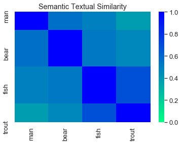

**See full repo at https://github.com/jeon11/use-glove-narrative.git**
<br>
**Note:** The results are shown in the [poster](/#posters)


## Overview
**Google's Universal Sentence Encoder (USE)** provides 512-dimension vectors for each input that are pre-trained on large corpus, and can be plugged into a variety of different task models, such as sentiment analysis, classification, and etc. It is speed-efficient without losing task accuracy, and also provides embeddings not just for word level, but also for phrases, sentences, and even paragraphs. However, the more the words are given as input, the more likely each word meaning gets diluted.

This notebook is based on the Semantic Similarity with TF-Hub Universal Encoder tutorial, but uses a separate input from one of the projects. We will also use **GloVe** vectors to compare how the vectors and cosine similarity differ between the two models.

- First, the notebook goes over setting up locally and use one sample data to create embeddings saved out as a separate csv file using Pandas.

- Then assuming you have cloned the repository, we call in custom functions to quickly extract vectors of given word, phrase, sentences in USE and GloVe.

### Table of Contents/Short-cuts:
1. [About USE Models and Deep Average Network](#About-USE-Models-and-Deep-Average-Network)
2. [Installation & Setup](#Installation-&-Setup)
3. [Path Setup](#Path-Setup)
4. [Raw Data Format](#Raw-Data-Format)
5. [Get USE Embeddings](#Get-USE-Embeddings)
6. [Cosine Similarity](#Cosine-Similarity)
7. [Cosine Similarity Examples](#Cosine-Similarity-Example)
8. [Plotting Similarity Matrix](#Plotting-Similarity-Matrix)

### About USE Models and Deep Average Network
There are two types of models in **USE**: **Transformer** and **Deep Averaging Network (DAN)**. We will use DAN which is a lighter version for efficiency and speed in exchange for reduced accuracy (still accurate enough).

DAN first averages the input word embeddings to create a sentence embedding. It uses PTB tokenizer, which divides a sentence into a sequence of tokens based on set of rules on  how to process punctuation, articles, etc, in order to create 512 dimension embeddings. This averaged 512 vector is passed to one or more feedforward layers. Then it is multi-task-trained on unsupervised data drawn from various internet sources,  Wikipedia, Stanford Natural Language Inference corpus, web news, and forums.
- Training  goals:
    - Uses skip-thought-like model that predicts the surrounding sentences of a given text (see below)
    - Conversational response suggestion
    - Classification task on supervised data

The intuition behind deep feedforward neural network is that each layer learns a more abstract representation of the input than the previous one. So its depth allows to capture subtle variations of the input with more depths. Also, each layer only involves a single matrix multiplication, allowing minimal computing time.

See full USE paper: https://arxiv.org/pdf/1803.11175.pdf
See full DAN paper: https://people.cs.umass.edu/~miyyer/pubs/2015_acl_dan.pdf

----

### Installation & Setup
I used Anaconda to create a TensorFlow-specific environment to customize the package versions. After installing Anaconda...

1. Creating a new environment:
```
conda create -n py3 python=3.6.8
```
2. Activate the created environment by `conda activate py3`

3. Using pip, install packages for pandas, numpy, seaborn, tensorflow, tensorflow_hub. ie. `pip install pckge-name`

4. Then, let's make sure to set the packages to exact version:
```
pip install --upgrade tensorflow=1.15.0
pip install --upgrade tensorflow-hub=0.7.0
```

Once the steps are done, we should be able to run the codes locally.

-----


```python
from absl import logging
import tensorflow as tf
import tensorflow_hub as hub
import matplotlib.pyplot as plt
import numpy as np
import os
import pandas as pd
from glob import glob
import re
import seaborn as sns
```

**Note:**
due to some depecrated methods and changes made with the tf version upgrade from tf1.X to tf2.0, here we use a specific set of Python and tf versions. You can check via `pip freeze`

- tested on python == 3.6.8 | tensorflow == 1.15.0 | tensorflow_hub == 0.7.0

Or you can check the version in Python via:
```python
import sys
print(sys.version_info)  # sys.version_info(major=3, minor=6, micro=8, releaselevel='final')
print(tf.__version__)    # '1.15.0'
print(hub.__version__)   # '0.7.0'
```


```python
# script variables

# for lite/DAN version:
module_url = "https://tfhub.dev/google/universal-sentence-encoder/2"

# for heavy/Transformer version:
# module_url = "https://tfhub.dev/google/universal-sentence-encoder-large/3"

baseDir = 'use-glove-narrative'  # repository/base folder name
embedding_size = 512  # base 512-dimension embedding
```

----

### Path Setup
Assuming that you git cloned the project (which is for demo purposes) to your local directory, we set the path so the code knows where to look for certain data files using the `baseDir` specified above. We will mainly just work within the cloned folder.


```python
pwd = os.getcwd()
# recursively find absolute path
while os.path.basename(pwd) != baseDir:
    os.chdir('..')
    pwd = os.getcwd()
baseDir = pwd
dataDir = baseDir + '/data'

# recursively find all csv files. We will work with one file here
all_csvs = [y for x in os.walk(dataDir) for y in glob(os.path.join(x[0], '*.csv'))]
all_csvs.sort()
all_csvs = all_csvs[0]  # we will just use one sample data
```

### Raw Data Format
To briefly show the data, the data is comprised of numerous idea units, or phrases of words with unique meanings. Here, we are only interested in the 'text' column and 'index' column. We will call in the text of the entire story to create embeddings for each idea unit. Below the example print out, we will loop over each story to create embeddings. Since we will use one story this time, it shouldn't take that long.


```python
# an example print of data format
datafile = pd.read_csv(all_csvs)
datafile.head()
```


<div>
<style scoped>
    .dataframe tbody tr th:only-of-type {
        vertical-align: middle;
    }

    .dataframe tbody tr th {
        vertical-align: top;
    }

    .dataframe thead th {
        text-align: right;
    }
</style>
<table border="1" class="dataframe">
  <thead>
    <tr style="text-align: right;">
      <th></th>
      <th>paragraph</th>
      <th>index</th>
      <th>text</th>
      <th>scoring</th>
    </tr>
  </thead>
  <tbody>
    <tr>
      <th>0</th>
      <td>1</td>
      <td>1</td>
      <td>One fine day an old Maine man was fishing</td>
      <td>mentions at least 3 of the following: “old”, “...</td>
    </tr>
    <tr>
      <th>1</th>
      <td>1</td>
      <td>2</td>
      <td>on his favorite lake</td>
      <td>mentions “favorite lake” or “favorite river”</td>
    </tr>
    <tr>
      <th>2</th>
      <td>1</td>
      <td>3</td>
      <td>and catching very little.</td>
      <td>mentions that he/the fisherman was not having ...</td>
    </tr>
    <tr>
      <th>3</th>
      <td>1</td>
      <td>4</td>
      <td>Finally, he gave up</td>
      <td>mentions that he gave up/stopped fishing</td>
    </tr>
    <tr>
      <th>4</th>
      <td>1</td>
      <td>5</td>
      <td>and walked back along the shore to his fishing...</td>
      <td>mentions that he walked home/to his fishing sh...</td>
    </tr>
  </tbody>
</table>
</div>


----
## Get USE Embeddings


```python
# let's read in the data file
textfile = pd.read_csv(all_csvs)
# get the title of the narrative story, cutting out the .csv extension
title = os.path.basename(all_csvs)[:-4]


# create df to save out at the end
vector_df_columns = ['paragraph', 'index', 'text', 'size']
# create column for each dimension (out of 512)
for i in range(1, embedding_size + 1):
    vector_df_columns.append('dim' + str(i))
vector_df = pd.DataFrame(columns=vector_df_columns)


# import the Universal Sentence Encoder's TF Hub module
embed = hub.Module(module_url)  # hub.load(module_url) for tf==2.0.0

# we call in the text column from data file
messages = []
for t in range(0, len(textfile)):
    messages.append(textfile.iloc[t]['text'])

```


```python
# Reduce logging output.
logging.set_verbosity(logging.ERROR)

with tf.compat.v1.Session() as session:
    session.run([tf.compat.v1.global_variables_initializer(), tf.compat.v1.tables_initializer()])
    message_embeddings = session.run(embed(messages))

# make sure all units are there/sanity check
assert len(message_embeddings) == len(textfile) == len(messages)

# loop over each vector value to corresponding text
for e in range(0, len(message_embeddings)):
    vector_df.at[e, 'paragraph'] = textfile.iloc[e]['paragraph']
    vector_df.at[e, 'index'] = textfile.iloc[e]['index']
    vector_df.at[e, 'text'] = messages[e]
    vector_df.at[e, 'size'] = len(message_embeddings[e])
    for dim in range(0, len(message_embeddings[e])):
        vector_df.at[e, 'dim'+str(dim+1)] = message_embeddings[e][dim]

# display sample format
vector_df.head()

```

    INFO:tensorflow:Saver not created because there are no variables in the graph to restore


    INFO:tensorflow:Saver not created because there are no variables in the graph to restore


<div>
<style scoped>
    .dataframe tbody tr th:only-of-type {
        vertical-align: middle;
    }

    .dataframe tbody tr th {
        vertical-align: top;
    }

    .dataframe thead th {
        text-align: right;
    }
</style>
<table border="1" class="dataframe">
  <thead>
    <tr style="text-align: right;">
      <th></th>
      <th>paragraph</th>
      <th>index</th>
      <th>text</th>
      <th>size</th>
      <th>dim1</th>
      <th>dim2</th>
      <th>dim3</th>
      <th>dim4</th>
      <th>dim5</th>
      <th>dim6</th>
      <th>...</th>
      <th>dim503</th>
      <th>dim504</th>
      <th>dim505</th>
      <th>dim506</th>
      <th>dim507</th>
      <th>dim508</th>
      <th>dim509</th>
      <th>dim510</th>
      <th>dim511</th>
      <th>dim512</th>
    </tr>
  </thead>
  <tbody>
    <tr>
      <th>0</th>
      <td>1</td>
      <td>1</td>
      <td>One fine day an old Maine man was fishing</td>
      <td>512</td>
      <td>0.0169429</td>
      <td>-0.0030699</td>
      <td>-0.0156278</td>
      <td>-0.00649163</td>
      <td>0.0213989</td>
      <td>-0.0541645</td>
      <td>...</td>
      <td>0.0404136</td>
      <td>-0.0577177</td>
      <td>0.0108959</td>
      <td>-0.0337963</td>
      <td>0.0817816</td>
      <td>-0.074783</td>
      <td>0.0231454</td>
      <td>0.0719041</td>
      <td>-0.047105</td>
      <td>0.0127639</td>
    </tr>
    <tr>
      <th>1</th>
      <td>1</td>
      <td>2</td>
      <td>on his favorite lake</td>
      <td>512</td>
      <td>-0.0172151</td>
      <td>0.0418602</td>
      <td>0.0105562</td>
      <td>0.0290091</td>
      <td>0.0351211</td>
      <td>-0.0121579</td>
      <td>...</td>
      <td>0.0319399</td>
      <td>-0.0201722</td>
      <td>-0.00480706</td>
      <td>-0.0490393</td>
      <td>0.0562807</td>
      <td>-0.0840528</td>
      <td>0.0359073</td>
      <td>0.0519214</td>
      <td>0.0635523</td>
      <td>-0.0615548</td>
    </tr>
    <tr>
      <th>2</th>
      <td>1</td>
      <td>3</td>
      <td>and catching very little.</td>
      <td>512</td>
      <td>0.0515628</td>
      <td>0.00556853</td>
      <td>-0.0606079</td>
      <td>-0.0281095</td>
      <td>-0.0631535</td>
      <td>-0.0586548</td>
      <td>...</td>
      <td>-0.0266129</td>
      <td>0.0111167</td>
      <td>-0.0238963</td>
      <td>0.00741908</td>
      <td>-0.0685881</td>
      <td>-0.0858848</td>
      <td>0.066858</td>
      <td>-0.0616563</td>
      <td>-0.0844253</td>
      <td>-0.026685</td>
    </tr>
    <tr>
      <th>3</th>
      <td>1</td>
      <td>4</td>
      <td>Finally, he gave up</td>
      <td>512</td>
      <td>0.0818241</td>
      <td>0.00549721</td>
      <td>-0.0245033</td>
      <td>0.0286504</td>
      <td>-0.0284165</td>
      <td>-0.0575481</td>
      <td>...</td>
      <td>0.0474779</td>
      <td>-0.00603216</td>
      <td>-0.0116888</td>
      <td>-0.06419</td>
      <td>0.0268704</td>
      <td>-0.0640136</td>
      <td>0.103409</td>
      <td>-0.0235997</td>
      <td>-0.0781731</td>
      <td>-0.0365196</td>
    </tr>
    <tr>
      <th>4</th>
      <td>1</td>
      <td>5</td>
      <td>and walked back along the shore to his fishing...</td>
      <td>512</td>
      <td>0.00286058</td>
      <td>0.0576001</td>
      <td>0.0103945</td>
      <td>-0.00301533</td>
      <td>0.0199591</td>
      <td>-0.0644398</td>
      <td>...</td>
      <td>-0.0145959</td>
      <td>0.0137776</td>
      <td>0.0165417</td>
      <td>-0.0406641</td>
      <td>-0.0204453</td>
      <td>-0.0713526</td>
      <td>0.0121754</td>
      <td>0.00591647</td>
      <td>0.0262764</td>
      <td>-0.0329477</td>
    </tr>
  </tbody>
</table>
<p>5 rows × 516 columns</p>
</div>


```python
print(np.shape(vector_df))
```

    (0, 516)


The sample data shows each idea unit/text converted to 512 dimension vectors. `np.shape(vector_df)` will return a 41 total idea units/phrases to 516 columns (512 dimensions + custom columns (paragraph info, index, text, and size)). We then use these vectors to explore semantic similarity between text and phrases.


```python
# run the code below to save out as csv file
vector_df.reindex(columns=vector_df_columns)
vector_df.to_csv(title + '_vectors.csv', index=False)
```

--------------
## Cosine Similarity
As a brief description, **cosine similarity** is basically the measure of cosine angle between the two vectors. Since we have USE and GloVe vectors that represent words into multidimensional vectors, we can apply these vector values to calculate how similar the two words are.

It can be easily calculated in Python with its useful packages:
```python
cos_sim = numpy.dot(vector1, vector2)/(numpy.linalg.norm(vector1) * numpy.linalg.norm(vector2))
```

Assuming we established some basic understanding, let's call in the functions I made so that we can easily get USE and GloVe vectors at multiple word level.

I will highlight some of the functions below:


```python
from get_glove_use import *
help(glove_vec)
help(use_vec)
```

    Help on function glove_vec in module get_glove_use:

    glove_vec(item1, item2)
        get vectors for given two words and calculate cosine similarity

        Parameters
        ----------
        item1 : str
            string in glove word pool vector to compare
        item2 : str
            string in glove word pool vector to compare

        Returns
        -------
        item1_vector : array
            item1 GloVe vector
        item2_vector : array
            item2 GloVe vector
        cos_sim : float
            cosine similarity of item1 and item2 vectors

    Help on function use_vec in module get_glove_use:

    use_vec(item1, item2)
        get USE vectors and cosine similairty of the two items

        Parameters
        ----------
        item1 : str, list
            any word to compare, put in string for more than one word
        item2 : str, list
            any word to compare, put in string for more than one word

        Returns
        -------
        item1_vector : array
            item1 USE vector
        item2_vector : array
            item2 USE vector
        cos_sim : float
            cosine similarity of item1 and item2 vectors


### Cosine Similarity Example
Using the two functions above, and another function compare_word_vec (which basically uses the two functions), we can easily obtain cosine similarity of two words.


```python
# using the two functions above, we can get
# GloVe and USE vectors and cosine similarity of two input words
os.chdir(gloveDir)
_, _, glove_sim = glove_vec('fish','bear')
_, _, use_sim = use_vec('fish','bear')
print('use cos: ' + str(use_sim))
print('glove cos: ' + str(glove_sim))
```

    INFO:tensorflow:Saver not created because there are no variables in the graph to restore


    INFO:tensorflow:Saver not created because there are no variables in the graph to restore


    0.11964830574261577
    0.5305143


```python
# the two functions glove_vex and use_vec are use in compare_word_vec
compare_word_vec('man','fish')
```

    INFO:tensorflow:Saver not created because there are no variables in the graph to restore


    INFO:tensorflow:Saver not created because there are no variables in the graph to restore


    use cos: 0.49838725
    glove cos: 0.18601566881803455


**Note:** From the example above, USE and GloVe similarly identy _fish_ to be somewhat equally similar to _bear_ and _man_ (but just in different scale/degree).

Now let's try comparing at multiple words or phrase level. We will use new functions and give in new inputs as strings.


```python
sentence1 = ['old', 'man', 'caught', 'fish']
sentence2 = ['bear', 'hunted', 'trout']
sentence3 = ['bear','eat','six','fish']

print('old man caught fish & bear hunted trout:')
phrase_vec(sentence1, sentence2)

print('old man caught fish & bear eat six fish:')
phrase_vec(sentence1, sentence3)

print('bear hunted trout & bear eat six fish:')
phrase_vec(sentence2, sentence3)

```

    old man caught fish & bear hunted trout:
    INFO:tensorflow:Saver not created because there are no variables in the graph to restore


    INFO:tensorflow:Saver not created because there are no variables in the graph to restore


    glove sim: 0.36609688461789297
    USE sim: 0.50494814
    old man caught fish & bear eat six fish:
    INFO:tensorflow:Saver not created because there are no variables in the graph to restore


    INFO:tensorflow:Saver not created because there are no variables in the graph to restore


    glove sim: 0.6818474640845398
    USE sim: 0.5896743
    bear hunted trout & bear eat six fish:
    INFO:tensorflow:Saver not created because there are no variables in the graph to restore


    INFO:tensorflow:Saver not created because there are no variables in the graph to restore


    glove sim: 0.6082457470353315
    USE sim: 0.72352856


**Note:** From the example above, we can see that USE and GloVe capture somewhat differently. We can see that _bear hunted trout_ and _bear eat six fish_ are the most similar to each other, whereas _old man caught fish_ is also similar to the context of bear eating six fish.

More detailed analysis is required, but the example above shows great possibilities to exploring semantics.

### Plotting Similarity Matrix
Now that we can compare similarity of words and sentences, we can plot a simple pairwise matrix, which basically compares how similar each word is to another in the given list. Fortunately, we already have a plot for doing it (using Seaborn).

I will only use few words as demonstration, since it's been slowing up my computer so much!


```python
plot_sim_matrix(['man', 'bear', 'fish', 'trout'])
```

    INFO:tensorflow:Saver not created because there are no variables in the graph to restore


    INFO:tensorflow:Saver not created because there are no variables in the graph to restore





## Ending Note

In the example above, we only used simple noun words. The stronger blue color, the more similar the two words are. Thus, the diagonal strip is deep blue (similarity of same two words is 1). You can see _fish_ and _trout_ are more similar to each other, than is _man_ to _trout_.

Keep in mind that you can feed in more words and sentences to create and visualize a larger matrix.

We looked at setting up USE locally, and creating embeddings from USE. The cloned project also has sample version of GloVe vectors. We use the vectors from the two models to extract vectors and compare similarity of two texts.
