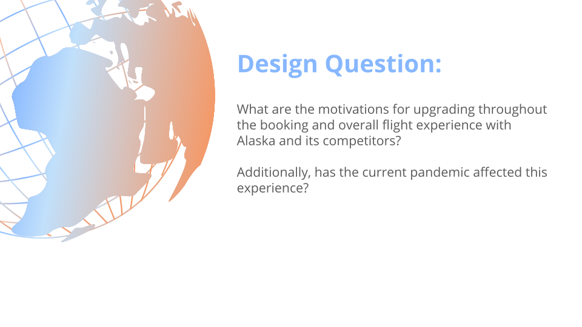
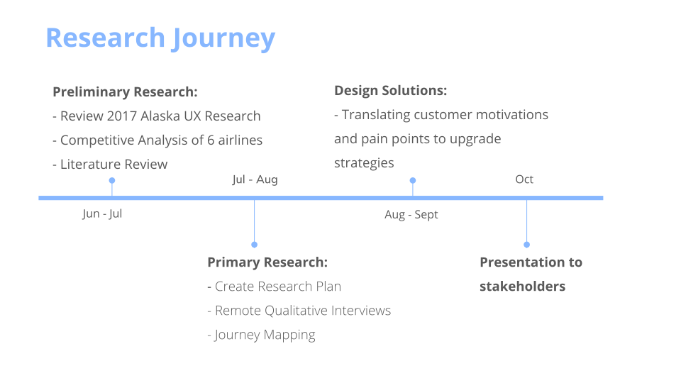
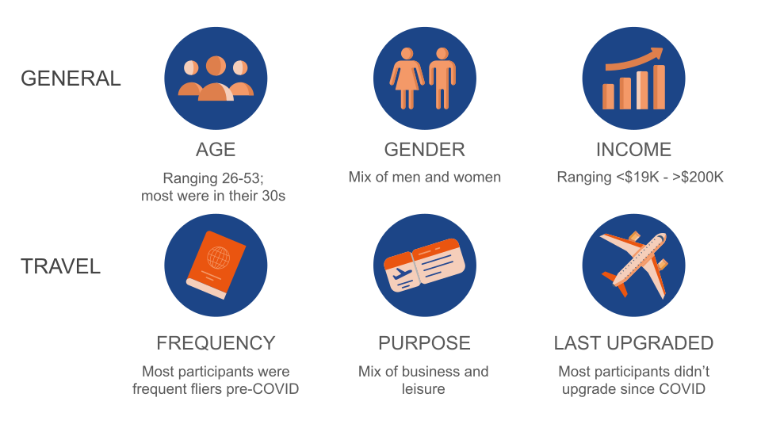
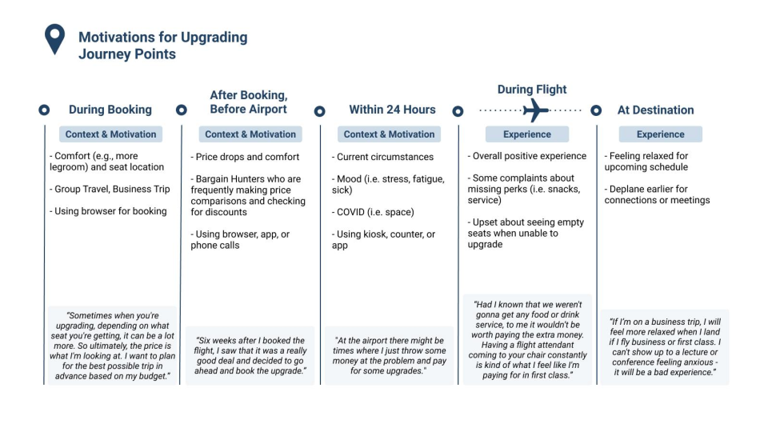
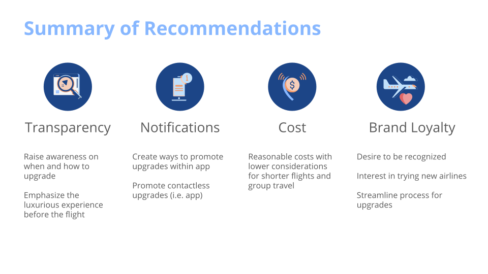
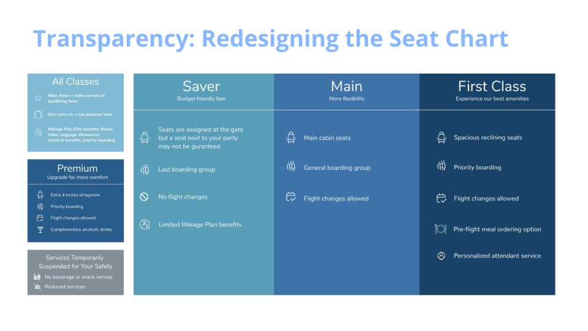
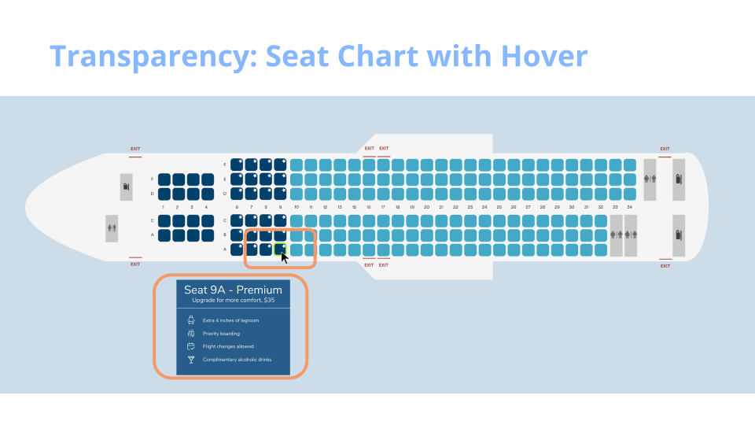

<body style="font-family:Arial; font-size: 12pt">

<b>My Role:</b>
 <small>UX researcher in a 4-person team of researchers and designers</small>  

<b>Methods:</b>
 <small>generative research, competitive analysis, remote qualitative interview, journey map, affinity diagram</small>  

<b>Timeline: </b>
 <small>June 2020 - Oct 2020 (~4 months)</small>  

<b>Stakeholders:</b>
 <small>Research manager, product designers,  brand manager, eCommerce team</small>

___
<!--  -->
## Overview
To help Alaska Airlines flexibly adapt to the COVID-19 pandemic and improve its upsell strategies, we conducted user research to understand users' behaviors, values, and motivations at different stages of their flight travel experiences. We studied Alaska Airlines and five other major airlines operating in the US to conduct competitive analysis and pair insights from user experience benchmarking.

## Impact
We presented four recommendations to research managers, product and eCommerce teams. Some of the research findings matched with the ongoing research that was being conducted internally within the company, suggesting the validity of research. Other recommendations provide new insights to improve users' overall experience by adapting to the pandemic world.

<!--  -->
## Research Question
> 
<mark><em>"What are the motivations for upgrading throughout the booking and overall flight experience with Alaska and its competitors? Additionally, has the current pandemic affected this experience?"</em></mark>  

___
# BELOW ARE UNDER CONSTRUCTION.
# PLEASE VISIT BACK!

## User Research
We conducted a total of 30 remote qualitative interviews (5 participants for 6 different airlines). We probed for X, Y, Z, and also had users interactively participate in the session through journey mapping in the Miro board.

## Results
We divided the users journey map into 5 stages:

1. During the initial booking
2. After booking but more than 24 hours from day of travel
3. Getting to the airport and the process to onboarding the plane
4. During flight
5. Arriving at the destination

## Recommendations

---
</body>
