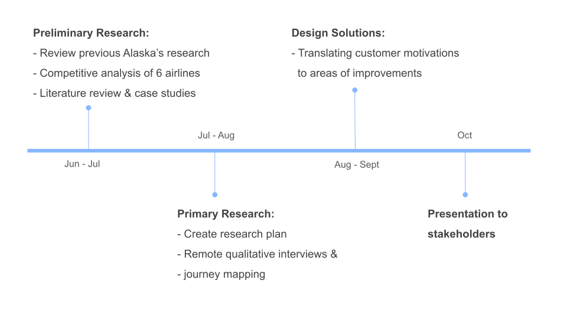

<body style="font-family:Arial; font-size: 12pt">

<b><h style="font-family:georgia"> My Role: </h></b>
 <small>UX researcher in a 4-person team of researchers and designers</small>  

<b><h style="font-family:georgia"> Methods: </h></b>
 <small>generative research, competitive analysis, remote qualitative interview, journey map, affinity diagram</small>  

<b><h style="font-family:georgia"> Timeline: </h></b>
 <small>June 2020 - Oct 2020 (~4 months)</small>  

<b> <h style="font-family:georgia"> Stakeholders:</h></b>
 <small>Research manager, product designers,  brand manager, eCommerce team</small>

___
## <h style="font-family:georgia"> Overview </h>
**To help Alaska Airlines flexibly adapt to the COVID-19 pandemic and improve its upsell strategies**, the team conducted user research **to understand users' behaviors, values, and motivations at different stages of their flight travel experiences.** We studied Alaska Airlines and five other major airlines operating in the US to conduct competitive analysis and pair insights from user experience benchmarking.

## <h style="font-family:georgia"> Impact </h>
- **Presented four major recommendations** to research managers, product and eCommerce teams.
- **Validated research findings** by discovering results that match with other ongoing research.
- Provided both **design recommendations** and **strategies** on how the company in the travel industry can **adapt and strive during the pandemic.**

 

## <h style="font-family:georgia"> Research Question </h>
> 
<mark><em>"What are the motivations for upgrading throughout the booking and overall flight experience with Alaska and its competitors? Additionally, has the current pandemic affected this experience?"</em></mark>  

___
## <h style="font-family:georgia"> Project Timeline </h>
<!--  -->

___

 

## <h style="font-family:georgia"> User Research </h>

### 1. Preliminary & Competitive Analysis

**Goal:** 
To first better understand the competitive landscape of the airline industries, we examined the websites of the six airlines to visualize the user flow of booking a flight.

💡 **Key/fun Fact:** 
Despite the industry standard of generalizing the classification of seat types into economy, business, and first class, we noticed that each airline had different ways of classifying, naming, and promoting the different fare classes. We searched for areas that could be confusing and be improved for the users.



#### Insights
1. **Alaska Airlines**' fare types were straightforward and transparent. The seat names were in consistent ascending order:  i.e. saver → economy → premium → first class.
2. Fare types and their associated perks can become very unclear: 
  e.g. **JetBlue**'s first class name was "Mint" which has no association with Blue. 
  e.g. **SouthWest**'s distinction between basic economy and economy was vague.
3. **United** had the most visually busy interface and complex fare types, leading to a poor booking experience.

### 2. Qualitative Interviews

**Goal:** 
To understand users':
<ol>
  <li>General flight behavior</li>
  <li>Top values </li>
  <li>Pain points </li>
</ol>

**Methods:** 
<ol>
<li><b>Remote Qualitative Interview: </b> 
We conducted a total of 30 interviews (5 participants from 6 different airlines) remotely over UserTesting.com and Zoom. We probed for their general flying behaviors and preferences, and narrowed down to their most recent flight experience (considering both pre-COVID & post-COVID).</li>


<li><b>Interactive Journey Maps:</b> 
We incorporated an **interactive journey map** session in each interview to have participants walkthrough their most recent experience and capture their moment-to-moment emotions and actions.</li>

To capture their moment-to-moment emotions and actions, we divided the entire flight experience into 5 phases:
<ol>
<li>**booking the flight ticket** (e.g. web vs. mobile vs. phone)</li>
<li>**before 24 hours of travel** (includes preparation and traveling to the airport)</li>
<li>**being at the airport** (checking-in, luggage, security checks, and so on)</li>
<li>**in-flight** (seat space, perks, food & beverage, etc)</li>
<li>**arrival** (post travel experience)</li>

</ol>

## 3. Thematic Analysis




___
## <h style="font-family:georgia"> Key Insights & Results </h>
Please note that below are **_filtered results_** due to NDA.

### Personas / Highlights
Three prototypical personas were developed. The information provides **basic demographic** information, a hypothetical trip destination, **quotes**, **means used to book and upgrade the seat.** It also identifies **top values, pain points, and motivations** for upgrading a seat. Only 1 of the 3 is shown here.
 <!-- (**we intentionally used the term "highlight" instead of "persona" because they were modeled after participants that stood out with clear preference of values and motivations**) -->
<!--  -->



<!--  -->

### Characterizing the Travel Experience


We then devised step-by-step recommendations for each travel stage (NDA).

___
## <h style="font-family:georgia"> Recommendations </h>

- Based on the key insights and results synthesized from the data, four major recommendations were made.



💡 **Key Fact:** 
<ol>
<li>**TRANSPARENCY MATTERS**: it is a critical factor in the overall experience especially due to COVID. Users desire clear communication on what services and ancillaries to expect when flying during this pandemic era.</li>

  - Quantitative metrics, such as **time to complete a booking**, are **less important** than **transparency**.
  - Transparency translates to expectations. When expectations are not met, the overall experience worsens.
  - Clear communication on what each seat upgrade entails can entice users.  e.g. **"upgrading a seat will get you a 7-inch wider leg room"**.
  <!-- <li>**Users don't mind receiving few more notifications** for clarifying and communicating the travel information (especially if contains deals). </li> -->
</ol>

### Design Recommendations
Based on the four recommendations, additional elements in the websites were modified to deliver transparency.

#### 1. Show what services are suspended


#### 2. Clearly communicate the perks of upgrading


---
## <h style="font-family:georgia"> Limitations & Lessons Learned </h>
1. The participants were not racially diverse as recruitment of participants were automatically done via UserTesting.com.

2. Majority of participants' recent travels occurred 6 months ago, in which they may have distorted memory of their travel experiences.

3. In a qualitative research, it's more about finding about the big buckets & themes unlike a quant research.  
When presenting the different demographic groups, it can be as easy as describing "we examined a wide income group" instead of graphing out all the different income groups. If all the demographic information was graphically presented, it can convey the different stakeholders, esp. data scientists, that the results and insights will be quant focused when the research is actually qualitative.



[Back to top ^](#)
---
</body>
